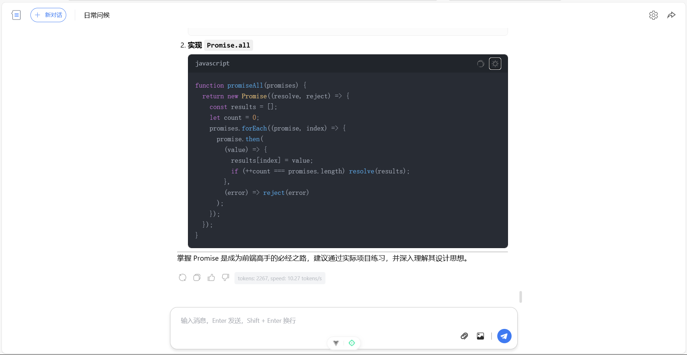

# 🤖 LLM Chat React

一个基于 React 19、TypeScript 和 Vite 8 的轻量级 AI 聊天界面，支持多会话、本地持久化、Markdown 渲染、代码高亮和流式输出。


## 🧠 作者想说
首先感谢一个开源LLM Chat Vue的老哥（他的版本在我主页Star中）,我主要把他的Vue3全家桶语法改为最新版本的React全家桶,并且增加一点安全校验去掉了硬编码API Key，Zustand状态同步等问题。欢迎大家Fork，Star和提Issues一起学习和交流！未来我会不断的改善这个React版本和增加RAG等功能！

## 📊 项目状态

这个项目目前是一个纯前端聊天客户端，适合用于：

- 🚀 快速搭建 AI 聊天 UI
- 🎯 演示流式输出与 Markdown 渲染
- 🔧 作为接入大模型 API 的前端模板

当前默认对接的是 SiliconFlow 兼容接口。

## ✨ 已实现功能

- 📋 多会话创建、切换、重命名、删除
- 💾 对话和设置持久化到浏览器本地
- ⚡ 流式响应与普通响应
- 📝 Markdown 渲染
- 🔍 代码高亮与代码块复制
- 🧠 推理内容展示
- 🖼️ 图片与文件本地预览
- 🔍 首页快捷搜索弹层
- 📱 基础响应式布局

## ⚠️ 当前限制

为了避免误解，这里特别说明一下当前版本的边界：

- 📤 上传的图片和文件目前主要用于前端预览，不会自动解析文件内容并发送给模型
- 🖥️ 项目当前没有后端代理层
- 🧹 代码质量检查仍有待继续完善，`npm run lint` 目前会报错
- 🏗️ 构建在部分受限 Windows 环境下可能遇到 `spawn EPERM`

如果你准备把它投入正式使用，建议优先补上后端代理、密钥管理和输入内容安全处理。

## 技术栈

- React 19
- TypeScript 5
- Vite 8
- React Router DOM 7
- Zustand 5
- Sass
- Markdown-it
- Highlight.js

## 目录结构

```text
src/
├── assets/          资源文件
├── components/      页面组件
├── pages/           页面入口
├── stores/          Zustand 状态管理
├── utils/           API、Markdown、消息处理
├── App.tsx
└── main.tsx
```

## 快速开始

### 环境要求

- Node.js 18 及以上
- npm 或 pnpm

### 安装依赖

```bash
npm install
```

### 配置环境变量

先复制示例文件，再填入你自己的 API Key：

```bash
cp .env.example .env.local
```

Windows PowerShell 也可以直接新建 `.env.local`，内容如下：

```env
VITE_SILICONFLOW_API_KEY=your_siliconflow_api_key_here
```

### 启动开发环境

```bash
npm run dev
```

### 运行代码检查

```bash
npm run lint
```

### 构建

```bash
npm run build
```

## 使用说明

1. 启动项目后，进入聊天页。
2. 打开右上角设置面板。
3. 在设置面板中填入你自己的 API Key，或提前在 `.env.local` 中配置。
4. 选择模型并调整参数。
5. 开始发送消息。

## 配置项

当前支持的主要设置包括：

- `model`
- `apiKey`
- `stream`
- `maxTokens`
- `temperature`
- `topP`
- `topK`

模型列表定义在 [src/stores/settingStore.ts](src/stores/settingStore.ts)。
如果 `.env.local` 中提供了 `VITE_SILICONFLOW_API_KEY`，应用会把它作为首次启动时的默认值。

## 截图

### 首页


### 独立对话界面



### 内联对话框


## 文档待完善项

后续还可以继续补充：

- API 接口说明
- 组件说明
- 状态流转说明
- 常见问题排查

## 说明

如果你正在继续维护这个项目，建议下一步优先处理这几件事：

1. 修复当前 lint 报错
2. 明确文件上传的真实能力边界
3. 为 Markdown 渲染增加安全过滤
