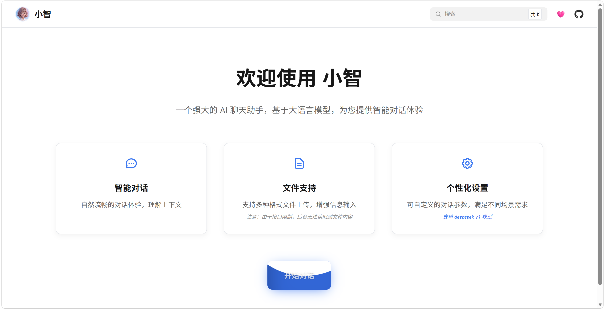
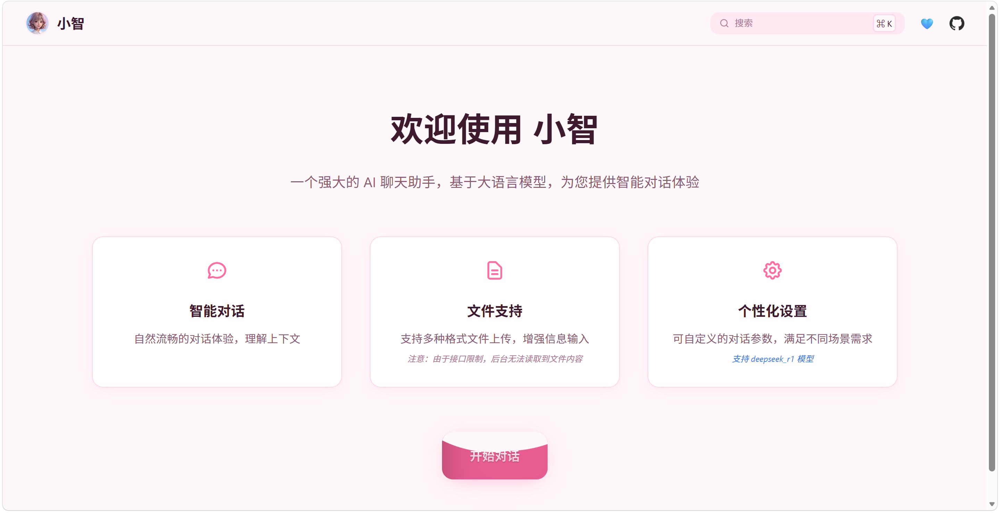
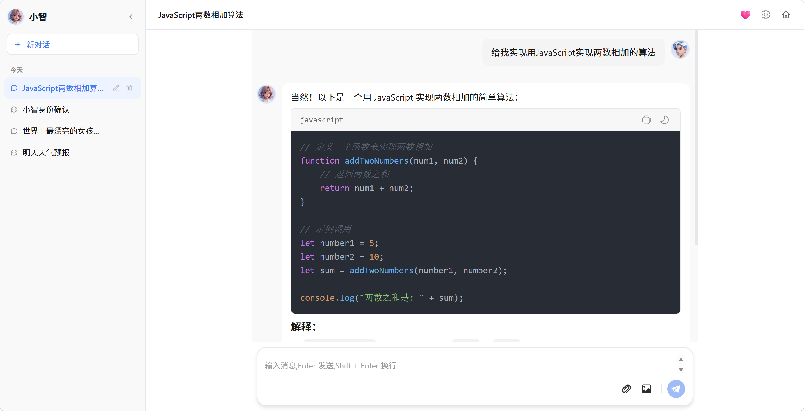
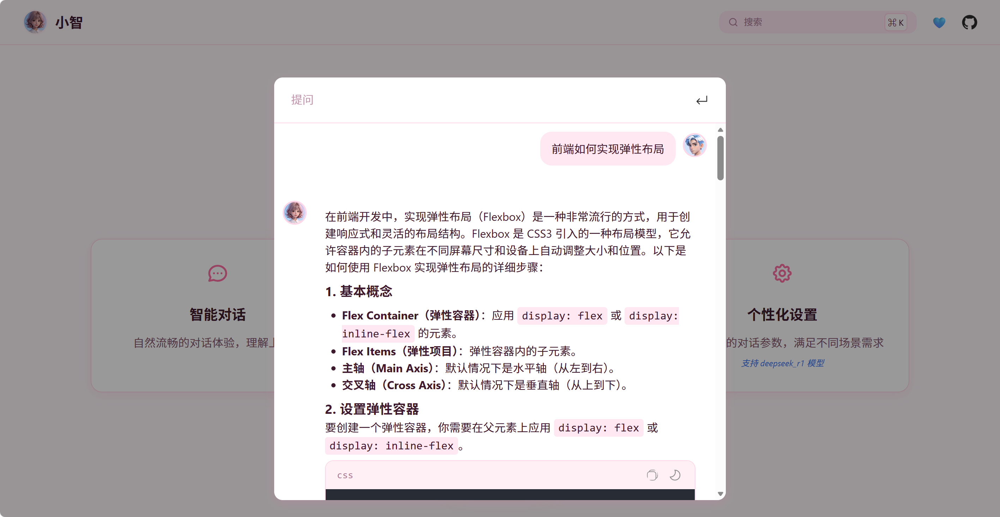

# 🤖 LLM Chat React 2.0

一个基于 React 19 + TypeScript + Vite 构建的轻量级 AI 聊天界面，对接 [SiliconFlow](https://siliconflow.cn) 开放平台，支持多模型、多会话、流式输出与主题切换。

**在线体验：** https://short-seven.github.io/LLM-chat-box2.0-React/
> 访问需要梯子，并在设置中填入硅基流动平台的 API Key

---

## 🧠 作者想说

感谢开源 LLM Chat Vue 的作者（在我主页 Star 中），本项目将其 Vue3 全家桶语法全面迁移至 React 19，并在此基础上做了大量改造和功能扩展：去除硬编码 API Key、引入 Zustand 状态管理、增加主题系统、流式中断机制等。欢迎 Fork、Star 和提 Issues 一起交流！

---

## ✨ 功能特性

### 对话体验
- **多会话管理** — 创建、切换、重命名、删除对话，侧边栏可折叠
- **AI 自动生成标题** — 首条消息发送后异步生成对话标题，不阻塞输入
- **流式输出** — 支持 SSE 流式响应，实时逐字显示回复内容
- **停止生成** — 流式响应中可随时点击停止按钮中断输出，已生成内容保留
- **切换对话自动中断** — 新开对话或切换会话时自动终止当前请求，避免多请求竞争
- **消息重新生成** — 对最后一条 AI 回复一键重新生成
- **深度思考展示** — 支持展示模型推理过程（reasoning_content），可折叠

### 内容渲染
- **Markdown 渲染** — 完整支持标题、列表、表格、引用、加粗等语法
- **代码高亮** — 基于 Highlight.js，支持多语言语法高亮
- **代码块复制** — 代码块右上角一键复制，带成功状态反馈
- **消息点赞 / 踩** — 对 AI 回复进行反馈标记

### 输入与上传
- **图片上传预览** — 支持本地图片附件预览（前端展示）
- **文件上传预览** — 支持 PDF、Word、TXT 等文件附件展示
- **Enter 发送 / Shift+Enter 换行** — 符合主流聊天软件习惯
- **自动高度调整** — 输入框随内容自动扩展，最大 6 行

### 外观与主题
- **双主题切换** — 默认主题与粉色主题（Pink）一键切换，刷新后恢复
- **粉色主题聚焦光晕** — 粉色模式下输入框获得焦点时有呼吸动画

### 设置与配置
- **设置面板** — 可视化配置 API Key、模型、流式开关、最大 Token、Temperature、Top-P、Top-K
- **本地持久化** — 对话记录与设置均持久化到浏览器 localStorage，刷新不丢失
- **环境变量注入** — 支持通过 `.env.local` 预设 API Key，首次打开自动填入

### 页面
- **首页** — 项目介绍 + 快捷搜索弹层，点击进入对话
- **对话页** — 独立全屏聊天视图，顶栏显示当前会话标题

---

## 🛠 技术栈

| 技术 | 版本 | 用途 |
|------|------|------|
| React | 19 | UI 框架 |
| TypeScript | 5 | 类型安全 |
| Vite | 8 | 构建工具 |
| React Router DOM | 7 | 路由管理 |
| Zustand | 5 | 全局状态管理 |
| Sass | — | 样式预处理 |
| markdown-it | — | Markdown 解析 |
| Highlight.js | — | 代码高亮 |

---

## 🤖 支持模型

通过硅基流动平台接入以下模型（可在设置面板中切换）：

| 模型 | 最大 Token |
|------|-----------|
| DeepSeek-R1 | 16384 |
| DeepSeek-V3 | 4096 |
| DeepSeek-V2.5 | 4096 |
| Qwen2.5-72B-Instruct-128K | 4096 |
| QwQ-32B-Preview | 8192 |
| GLM-4-9B-Chat | 4096 |
| GLM-4-9B-Chat (Pro) | 4096 |

---

## 📁 目录结构

```text
src/
├── assets/
│   ├── photo/           图标资源
│   ├── sampels/         截图示例
│   └── styles/          全局样式变量（SCSS）
├── components/
│   ├── layout/          ChatLayout、TopBar 布局组件
│   ├── sidebar/         Sidebar、ConversationList、ConversationItem
│   ├── ChatInput.tsx    输入框（含停止生成按钮）
│   ├── ChatMessage.tsx  消息气泡（含 Markdown、推理内容、操作栏）
│   ├── SettingsPanel.tsx 设置面板
│   ├── SearchDialog.tsx  首页搜索弹层
│   ├── DialogEdit.tsx   会话重命名弹框
│   └── ThemeToggleButton.tsx 主题切换按钮
├── pages/
│   ├── HomePage.tsx     首页
│   └── ChatView.tsx     对话页（含请求生命周期管理）
├── stores/
│   ├── chatStore.ts     对话状态（会话列表、流式状态、AbortController）
│   └── settingStore.ts  设置状态（模型、主题、参数）
├── utils/
│   ├── api.ts           SiliconFlow API 请求封装（含 signal 支持）
│   ├── messageHandler.ts 流式/普通响应解析（含 AbortError 处理）
│   └── markdown.ts      Markdown 渲染配置
├── App.tsx
└── main.tsx
```

---

## 🚀 快速开始

### 环境要求

- Node.js 18+
- npm 或 pnpm

### 安装依赖

```bash
npm install
```

### 配置 API Key

复制示例文件并填入你的硅基流动 API Key：

```bash
cp .env.example .env.local
```

`.env.local` 内容：

```env
VITE_SILICONFLOW_API_KEY=your_siliconflow_api_key_here
```

> 也可以不配置环境变量，直接在应用右上角的设置面板中填写 API Key。

### 启动开发服务

```bash
npm run dev
```

### 构建生产版本

```bash
npm run build
```

---

## 📖 使用说明

1. 打开应用后，点击首页「开始对话」或侧边栏「+ 新对话」进入聊天
2. 点击右上角 ⚙️ 图标打开设置面板，填入 API Key 并选择模型
3. 在输入框中输入消息，按 `Enter` 发送，`Shift + Enter` 换行
4. AI 输出期间点击 ■ **停止生成** 按钮可随时中断，已生成内容保留
5. 点击右上角 💗 图标可切换粉色主题
6. 对话列表支持右键或悬浮操作：重命名、删除

---

## ⚙️ 可配置参数

| 参数 | 说明 | 默认值 |
|------|------|--------|
| `apiKey` | SiliconFlow API Key | — |
| `model` | 使用的模型 | DeepSeek-R1 |
| `stream` | 是否开启流式输出 | `true` |
| `maxTokens` | 最大生成 Token 数 | 4096 |
| `temperature` | 随机性，越高越发散 | 0.7 |
| `topP` | 核采样概率 | 0.7 |
| `topK` | 每步候选词数量 | 50 |

---

## ⚠️ 当前限制

- **文件内容未发送给模型** — 上传的图片和文件目前仅在前端预览，不会解析内容并注入对话
- **无后端代理** — API Key 在浏览器中直接使用，生产环境建议增加后端代理层和密钥管理
- **Lint 警告** — `npm run lint` 目前存在部分警告，不影响运行

---

## 截图

### 蓝色和粉色主题



### 独立对话框



### 内联对话框



---

## 🤝 贡献

欢迎提 Issues 和 Pull Requests！如果这个项目对你有帮助，请点个 ⭐ Star 支持一下。
